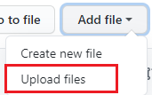
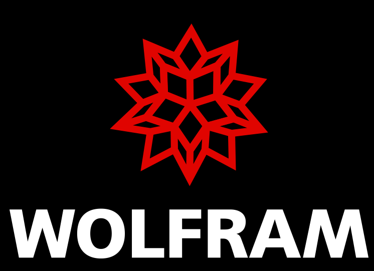

# Code-ify Physics! 2020

We are glad you are participating in YPA's third contest ever, Code-ify Physics! 2020. You may code any physics related program you wish in Python, Java, or any other programming languages. Possibilities include educational software, simulations and demonstrations, websites, and much more! The total prizes available are worth around \$1000!

If you are here about the submission process go straight to the [submission](#submission) part.

## Prizes

1. The top 3 contestants will win a 1 year licenses for both Wolfram | One and Wolfram | Alpha (\$300+ VALUE for each winner).
2. More prizes may be added depending on how much interest is shown.

## Register

1. Click this [link](1) to register
2. Registration must be completed before the submission deadline.
3. This is an individual contest.
4. You must be going to high school as of fall 2020 in order to participate.
5. After registering, you will receive a message confirming your registration within a couple days.

## Tasks

1. Combine physics with computer science in an interesting way.
2. Submit your codebase and a description of your project.
   - Any programming language may be used.
   - Include a README file with a description of your project as well as any necessary setup procedures (no longer than 600 words).
3. The submissions will be judged on specific criteria.
   - Useability/Effectiveness: your project accurately serves its designed purpose.
   - Uniqueness/Creativity: novelty and originality of ideas are highly valued.
   - Implementation of physics: your program must mainly be centered around something physics-related.
   - Complexity: thought and time has been put into the project.

## Rules

1. All work must be largely the contestant’s (you may still use libraries and frameworks, just make sure to build on top of them).
2. If your program is not self explanatory, then you are expected to submit a google docs/word document/pdf explain how to use your program with max 600 words, or have a tutorial on your program.
3. Do not have your name on your program for judging purposes.

## Submission

The submission via GitHub is desired by judges. This is easier to look at the code and judge. The submitting process contains a few steps(_Note:_ You need a GitHub account to do this. If you do not have one you can register from [here](2)):

### For contestants who are experienced in GitHub and source control systems

Fork this repo/clone it in your local machine/create a folder in root directory (the name of which is your name) and start making commits _only_ in that folder and create a pull request (_Note:_ If your files are in the root directory your work may not be accepted and the pull may not be merged in master branch).

### Detailed explanation of each step for contestants who is inexperienced or who has doubts

#### 1. Fork this repository

Start by [forking](3) this repository(just click on the link).

### If you are using a source control system like [git](4)

#### 2.1 Clone the repository

Clone the forked repository using this command from command line:

```cmd
git clone <link to your repository>
```

_Note_: The link to your repository will be https://github.com/your_github_username/code-ify-physics-2020.

#### 2.2 Commit your changes to `master` branch

The changes you make have to be in your folder and have to be committed to `master` branch

### If you are not using a source control system

Fortunately there is no need for fancy source control systems and command line interactions if you are not familiar with them. You can just upload your files via GitHub's web page. Here are instructions:

1. Create a folder in your computer with your name.
2. Make changes in it, add all of your project files.
3. Go to the forked repository page ar https://github.com/your_github_username/code-ify-physics-2020.
4. Click on "Add file" dropdown menu, then click "Upload files."



5. Click "choose your files"
6. Then select the folder that you want as your submission, then click "open"
7. Lastly, at the bottom there is a "Commit changes" green button; click on that, and you are done.

The next step is making a pull request!

### 3 Create a Pull Request

1. You can create a pull request using the button make Pull Request (below the green Code button). Make sure to you have open a pull request from your fork's `master` branch. To check this there's dropdown menu in the left:


2. Afterwards there is a green button named Create pull request. Click on that


3. Make the title of PR like this:

> Submission of <your_name_here>

obviously, without <> signs. If it is necessarry leave some commments. Next make sure you have checked "Allow edits by maintainers", and then click on Create pull request.

And you are done! Congratulations! You have submitted your work for Code-ify Physics! 2020. If you want to change something till deadline go ahead change in your forked repository it will be changed in Pull Request too. No need for new PR!
You can also check Python Discord's [page](https://pythondiscord.com/pages/code-jams/pull-request/) about making a PR. However, you have to follow the instructions above.

#### If you still have doubts join our [Discord server](5) and ask your question, our team is willing to help you out with anything you need!

### Submission via email

If you are having issues with submission process, consider join to our [Discord server](5) if anyone does not help or unable to help feel free to ping spitfire#8420. If you are still having issues then feel free to email your submission folder to YPAsubmission@gmail.com. This has to contain same content with submission via GitHub.

## Things to keep in mind

### Your project should be easy to set-up

You should make sure your project is easy to set up for us. It should not take us more than a few steps to get your project up and running, and those steps should be well-documented in your project’s README file.

### All projects will be merged into this repository

Your project will be merged into this repository at the end of the event. This means that your project will stay available after the event ends and that you'll get contributions credits for this repository on your GitHub account. Keep in mind that this repository is licensed under the [MIT open source license], which means that all the code and assets you submit for the Code-ify Physics! 2020 should be compatible with that license. In addition, please make sure to provide credit to the source of all third-party packages, even if the license of them does not require you to do so.

Please also make sure you follow the instructions in the [Submission](#submission) section. We can't merge Pull Requests that (would) create conflicts with the submissions of the other participants.

### Write a good README

Your project has to include documentation. At the very least, it should include instructions on how to set-up and run your projects, but keep in mind that a README is the first thing people typically see when they look at a project on GitHub. A good README includes a short description of the project, installation instructions, and often documents common usage of the application.

### The main language of your project should be English

As English is the only language the judges share, we require you to use English as the main language for your project. This means that your variable names, code comments, `git` commit messages, and documentation should all be in English. The text displayed in your result of the project should also be in English, although you are allowed to provide the user with options for internationalization and translation(but not required).

## Sponsors

Thanks to our sponsors the events are possible!

[](6) [](7)

[1]: https://forms.gle/P6mUqd6BcGxsNEh18
[2]: https://github.com/join
[3]: https://github.com/YPA-Physics/code-ify-physics-2020/fork
[4]: https://git-scm.com/
[5]: https://discord.gg/YtYaGpY
[6]: https://www.wolframalpha.com
[7]: https://www.maplesoft.com
